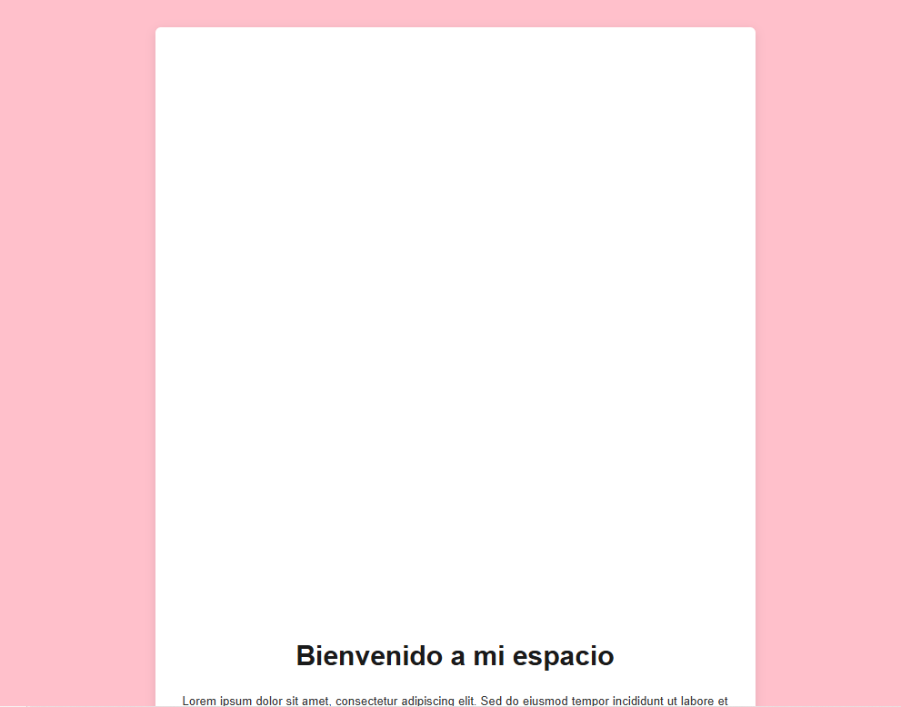
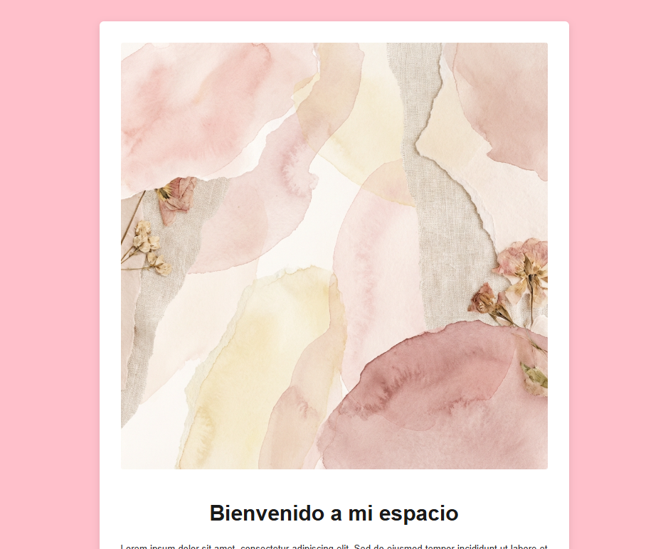

# Reto 13: Slide in on Scroll - Blog Personal

## Descripción
Este proyecto corresponde al Reto 13, cuyo objetivo es implementar un efecto de animación de "deslizamiento" en las imágenes a medida que el usuario hace scroll en la página. Se ha creado una estructura de blog personal donde las imágenes aparecen suavemente desde los lados (izquierda o derecha) cuando entran en el viewport.

## Tecnologías Utilizadas
*   HTML5
*   CSS3 / SCSS
*   JavaScript (ES6)

## Capturas de Pantalla / GIF

## Instrucciones de Instalación y Ejecución Local
1.  Clona este repositorio o descarga los archivos.
2.  Asegúrate de tener los archivos `index.html`, `style.css` (o compila el `style.scss`) y las imágenes en la misma carpeta.
3.  Abre el archivo `index.html` en tu navegador web de preferencia (Chrome, Firefox, Edge, etc.).
4.  Haz scroll hacia abajo para ver las animaciones en acción.

## Link al Despliegue
[Ver proyecto desplegado](https://camilyyyy.github.io/Reto13/)

## Autor
[Camily Solorzano]
